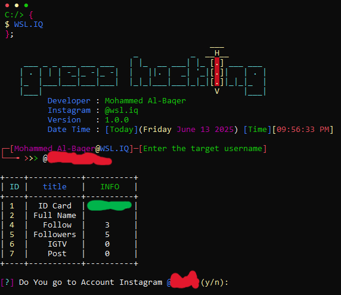
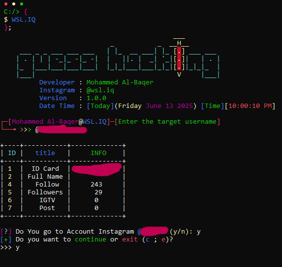
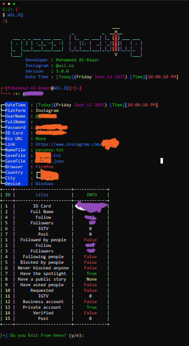

- ### **Tool Hacking Guess Password Instagram**

---

- **1- A** powerful tool of its kind where the user enters the **target username.**
- **2-** When you enter the target username it displays information about the `account` to verify it.
- **3-** When the basic information is displayed you agree to start the attack.
- **4-** The **attack** is carried out by using the guessing method via a file named `passkey.txt`.
- **5-** When a matching `password` is found, everything related to the account is displayed and the information is saved in a new file with the victim's username in `(*.txt) (*.json)` format.

---

<table>
  <tr>
    <td align="center">
       
    </td>
    <td align="center">
       
    </td>
  </tr>
  <tr>
    <td align="center">
       
    </td>
    <td align="center">
       
    </td>
  </tr>
</table>

---
### Compatibility and System Support

| Operating System | Logo | Supported |
|------------------|------|-----------|
| **Windows**      |  | ✅ |
| **Linux**        |  | ✅ |
| **macOS**        |  | ✅ |
| **Android**      |  | ✅ |

---

### **The price of the tool is**
- ### **`9.99$`**

---

### 
- 
- 
- 

---
