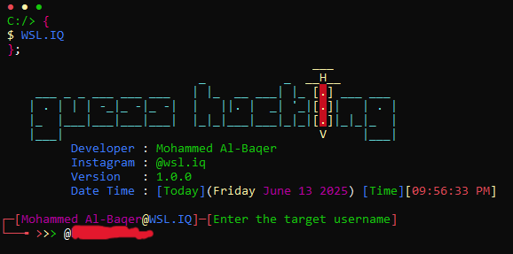

# Instagram Information & Brute-force Tool
```
HackInstagram
```
This Python script is designed to **gather detailed information** about an Instagram account and perform a simple **brute-force password attack** using a list of passwords provided in a `.txt` file.

---

## Features

- **Auto-detects system platform** (Windows, Linux, macOS)
- **Detects user location** using `ip-api`
- Shows a stylized banner with current **date and time**
- Fetches Instagram account details using `instaloader`, including:
  - Full name
  - User ID
  - Number of followers and followees
  - IGTV count, post count
  - Business category and external link
  - Account status (private, verified, business, etc.)
- Saves gathered info into both `.txt` and `.json` formats
- Supports optional redirection to the Instagram profile in a **web browser**

---

## Password Attack

- Uses a list of passwords from the file:  
  \`passkey.txt\`

- Attempts login through Instagram's endpoint:
  \`https://www.instagram.com/accounts/login/ajax/\`

- For each **password**, the script:
  - Sends an **authenticated POST request**
  - Waits for the response
  - If successful, it **saves the credentials**
  - If not, it continues to the next password

- Displays real-time feedback with:
  - `Trying password: ...`
  - `Login successful` or `Not correct password`

- After a successful login:
  - Account data is saved to:
    - \`<username>.txt\`
    - \`<username>.json\`
  - Additional account analysis is shown in a table

---

## Output Files

- `TXT File`: Contains basic credentials and bio  
- `JSON File`: Structured data for further use  
- Example file names:  
  - \`targetuser.txt\`  
  - \`targetuser.json\`

---

## Notes

- You can **cancel** the process anytime with `Ctrl + C`
- If no correct password is found, the script will notify:
  > `All passwords tested. No successful login!`

---

<div align="center">
<table>
  <tr>
    <td align="center">
      <a href="1.png" target="_blank">
        
      </a><br><sub></sub>
    </td>
    <td align="center">
      <a href="2.png" target="_blank">
        
      </a><br><sub></sub>
    </td>
  </tr>
  <tr>
    <td align="center">
      <a href="3.png" target="_blank">
        
      </a><br><sub></sub>
    </td>
    <td align="center">
      <a href="4.png" target="_blank">
        
      </a><br><sub></sub>
    </td>
  </tr>
</table>
</div>

---
### Compatibility and System Support

| Operating System | Logo | Supported |
|------------------|------|-----------|
| **Windows**      |  | ✅ |
| **Linux**        |  | ✅ |
| **macOS**        |  | ✅ |
| **Android**      |  | ✅ |

---
### **The price of the tool is**
- 

---


### 

- [](https://www.instagram.com/wsl.iq)
- [](https://t.me/wsl-iq)
- [](https://www.tiktok.com/@wsl.iq)

---
